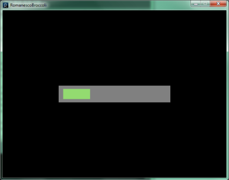
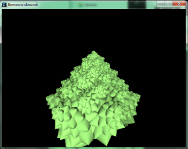
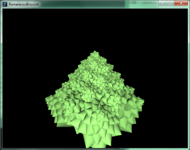

##Description

The Romanesco broccoli is a naturally occuring fractal. It is a vegetable similar to a hybrid between a cauliflower and a broccoli. It exibits self-similarity and can be replicated generatively using a recursive function.

The primitive shape on which the fractal is built is a cone, which has several other cones sprouting out of it’s surface  in a spiral — with the cones getting larger as they get closer to the bottom. By applying this same method to the cones on the primary cone’s surface, and so on, we can create a 3D fractal which approximates the shape of the romanesco broccoli.

That’s basically what this sketch does.

##Screenshots

  </img>&nbsp;

  </img>&nbsp;

  </img>&nbsp;

